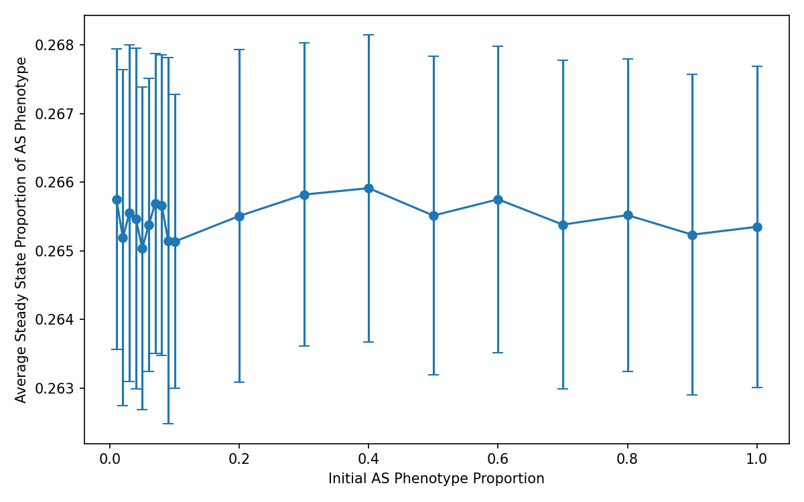
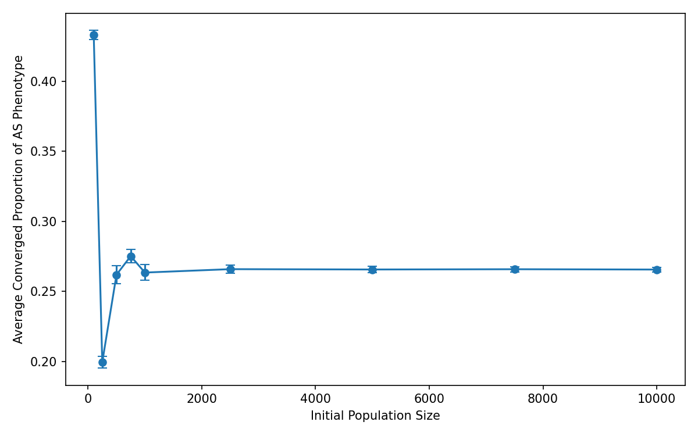
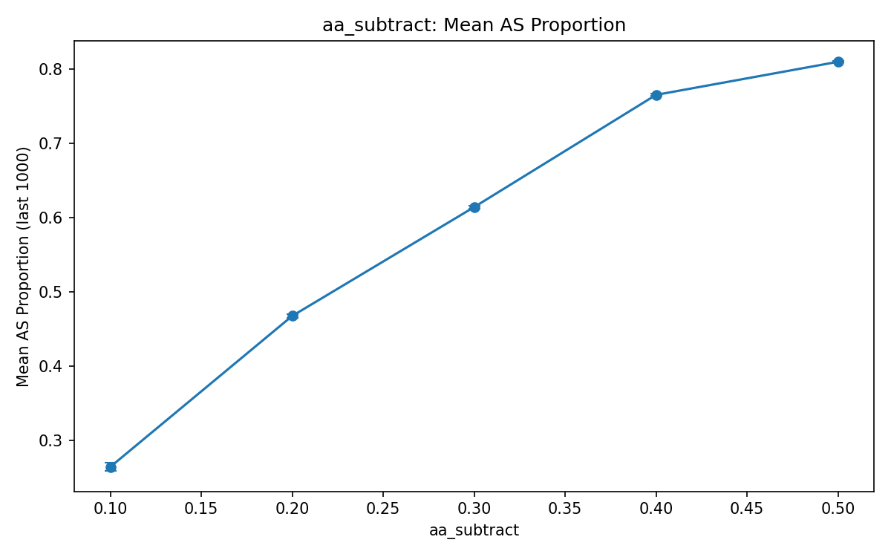
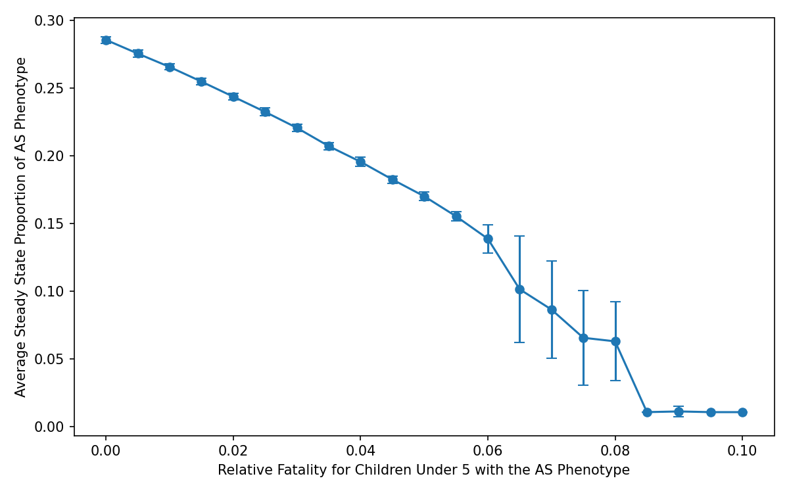
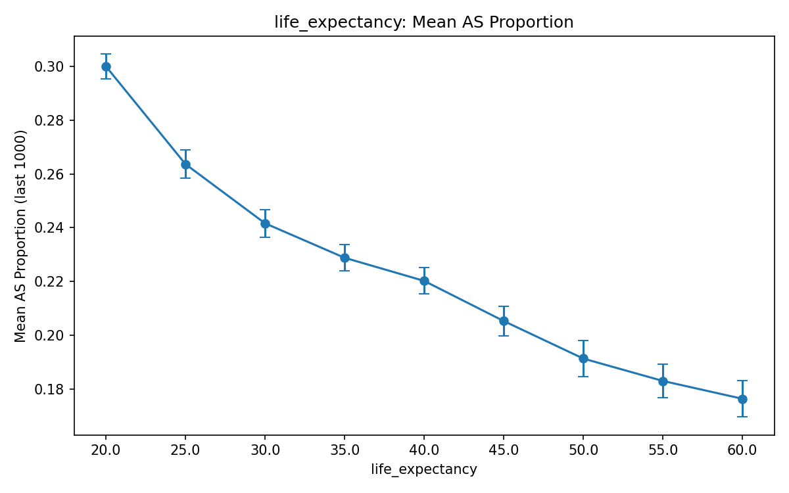
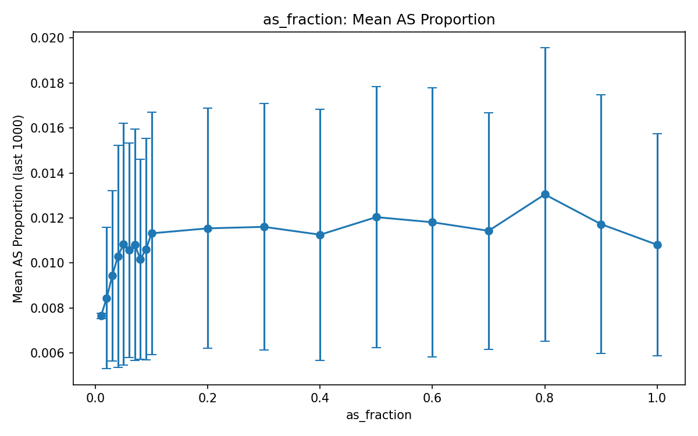
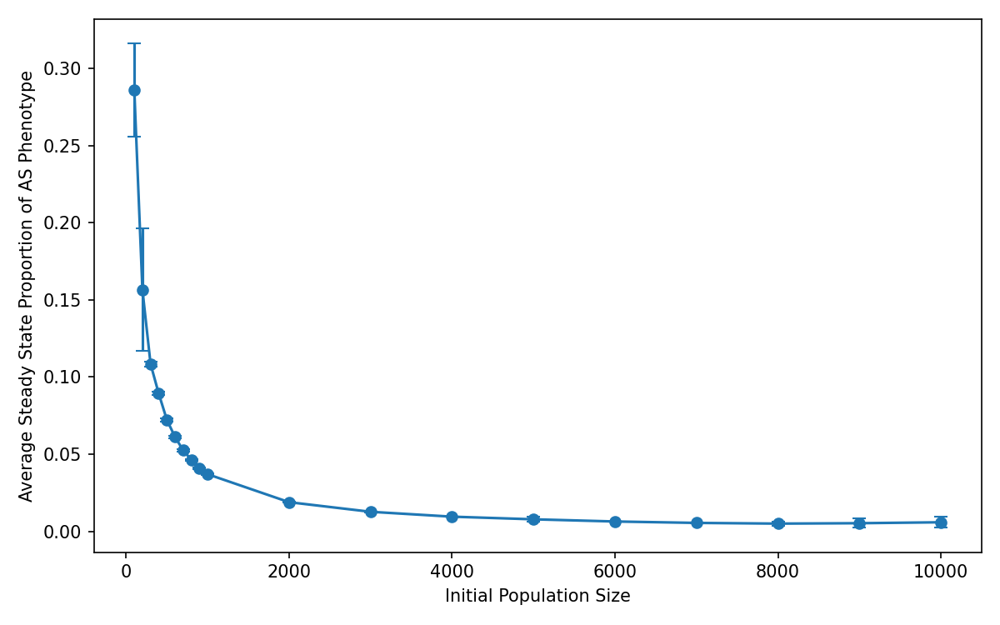
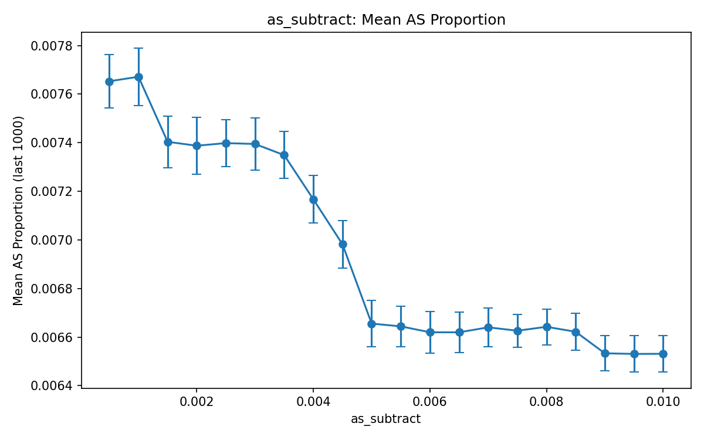
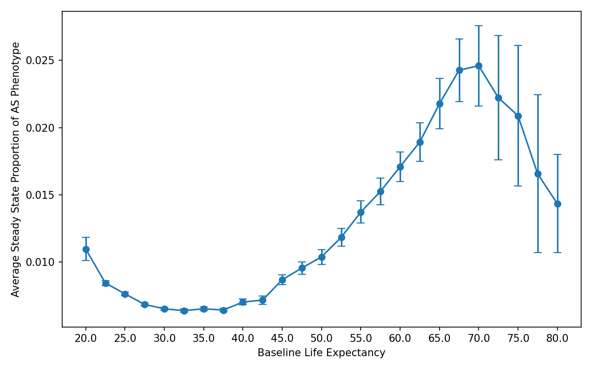

# Abstract

One of the most well known oddities of natural selection is the heterozygote advantage, where a autosomal recessive mutation is not heavily selected against despite having severe consequences, due to heterozygous individuals who posses a single copy of the mutated allele exhibiting significantly increased fitness, which counteracts negative selective pressures. The most well-documented example of the heterozygote advantage is Sickle Cell Anemia; individuals who are carriers for the Sickle Cell allele are conferred a 90\% reduction in Malarial related fatality. Hence, the frequency of the Sickle Cell Anemia Allele has historically been, and continues to be, high in areas where Malaria is present. By adapting the Leslie Model for multi-generational simulations in conjuction with a variant of the Beverton-Holt Model for population stability, we investigate the extent to which evolutionary dynamics simulation can recapitulate the phenomenon of the heterozygote advantage.

# 1 Background and Introduction

## 1.1 Allele Inheritance Patterns and Frequencies
In a majority of sexually reproduction organisms, including humans, offspring inherit one copy of each autosomal gene from each parent. For many genes, the copy inherited from each parent may be different; this genotypic variability gives rise to morphological and physiological differences that confer differing degrees of fitness to offspring with differing phenotypes. For individuals who are heterozygotes for a particular gene, that is, carrying two differing alleles for the gene, there are roughly three categories of gene expression which can dictate the phenotype observed in the individual [1]. The first case is complete dominance by one allele, where the heterozygous individual exhibits the same phenotype as an individual homozygous for the dominant gene. Such is the case for individuals with one allele for expressing brown eye-color and one allele expressing blue eye-color. The second case is codominance, where the individuals exhibits traits of both alleles. For instance, individuals with type AB blood are in fact heterozygotes for the A allele and the B allele, where both alleles code for proteins that are expressed. The third case is characterized by the individual carrying traits that are a partial mix of both alleles, often referred to as partial dominance or incomplete dominance. One such case of this can be observed in the crossing of flowers with red and white petals: one finds that the offspring flowers will have pink petals, differing from both of the parents. 

In general, differing alleles within the population create variability, which enables the population to be more adaptable to changing environments [2]. In some generations, a particular allele may be unfavorable with respects to the natural environment and predators present, and hence, the frequency will decrease due to selective pressures, but should the environment change such that this allele now becomes beneficial, after a few generations, the frequency can be expected to be quite high. The extinction of a given allele can be quite rare, and is almost entirely due to genetic drift, where an allele that is infrequent is simply lost due to not being passed down to offspring. Even highly detrimental mutations, if it does not cause death before reproductive age, can still remain in the population with low frequency. One example of this is Huntington's disease, which is an autosomal dominant mutation that causes sever neurological degeneration; that is, one mutated allele suffices to result in manifestation of degeneration However, because the most severe of symptoms appear after the individual reaches reproductive maturity, the allele can still be inherited by offspring;  hence, Huntington's disease can still be found in around one in 200,000 individuals globally [3]. This translates to an allele frequency of roughly one in 800,000. If the inheritance mechanism is autosomal recessive, the frequency of the allele in the population will be higher, as the selective pressure against the allele is lower. One example of this is Tay-Sachs Disease, which similarly causes neurodegeneration, but requires the presence of two mutated alleles to manifest. Tay-Sachs Disease is manifest in around one in 100,000 individuals globally, with one in 250 individuals being carriers for the disease [4]. This translates to roughly a one in 500 frequency of the allele in the population. Indeed, detrimental alleles can linger in the population, albeit at low levels.

However, in some cases, it may be surprisingly found that a detrimental allele has high frequency among the population. One of the most salient examples of this is Sickle Cell Anemia. Similar to Tay-Sachs, Sickle Cell Anemia follows an autosomal recessive pattern; heterozygotes for Sickle Cell Anemia generally do not experience any severe consequences. However, those who are unfortunate and have two mutated alleles often do not reach adulthood without medical intervention. The prevalence of the Sickle Cell mutation allele is startling: in certain geographical regions, 29\% of the adult population are carriers for the Sickle Cell allele, translating to an allele frequency of roughly one in six within the adult population [5]. This far exceeds any reasonably expected allele frequency for severe autosomal recessive diseases. To put into perspective, the Tay-Sachs Disease is highly prevalent in the Ashkenazi Jewish population due to the founder effect, where the allele frequency was randomly and artificially inflated due to a small population before the population grew and maintained the frequency [4]. Even in this case, Tay-Sachs disease is only seen in one in 3500 births and only one in 30 are carriers: this is a less than one percent frequency of the mutated allele in the population. This is a significant difference in allele frequency despite both Tay-Sachs and Sickle Cell Anemia historically causing death in childhood long before reproductive age. 

## 1.2 Sickle Cell Anemia, Malaria, and the Heterozygote Advantage
The main reason for the prevalence of the Sickle Cell Anemia mutation allele can be found in examining the regions where the allele frequency is high: these regions are typically in Africa, particularly in communities severely affected by Malaria. Indeed, although individuals homozygous for the Sickle Cell mutation (which we shall from hereonout denote with the genotype label $SS$) are subject to anemia, severely increased risk of infection, and organ failure, carriers of the Sickle Cell Mutation (which we shall denote with the genotype $AS$) not only do not suffer from the consequences of Sickle Cell Anemia, but also exhibit significantly increased resistance to Malaria-related complications. A majority of population studies on Malaria and the interaction between Malaria and Sickle Cell Anemia occur alongside medical intervention, and hence cannot offer a strong estimate of the fitness increase due to possessing the $AS$ genotype without treatment of Malaria, some early studies that did collect relevant data estimate that heterozygotes for the Sickle Cell mutation are conferred a decreased fatality rate of 90\% in infants, who are the primary group at risk of Malarial fatalities[5]. Hence, there are strong selective pressures in favor of the Sickle Cell allele: individuals possessing the allele as a heterozygote are far more likely to survive to reproductive age, hence passing those alleles on to offspring. This phenomenon is commonly known as the Heterozygote Advantage.

Ironically, the mechanism by which Sickle Cell Anemia induces severe clinical outcomes in $SS$ homozygotes is the same mechanism by which it confers Malarial resistance in $AS$ heterozygotes. In patients with full Sickle Cell Anemia, a point mutation in the hemoglobin protein causes a change in the folded structure. Not only does this lower the capacity of the hemoglobin to carry oxygen, it also makes the red blood cells in which this hemoglobin resides highly prone to structural warping: the red blood cells will cave into a sickle shape, hence the name of the disease [6]. This further reduces the ability of red blood cells to carry oxygen, and also increases the probability of clot formation. In heterozygotes, only a portion of the hemoglobin produced in each red blood cell contain this point mutation. As a result, the cells are less prone to spontaneous sickling, and only do so under stress. Enter Malaria, which is caused by the parasite *Plasmodium falciparum*, which enters the human bloodstream, often through mosquitos, and carries out an asexual reproductive process known as schizogony within red blood cells [6]. Incidentally, the shcizogonic cycle puts a strain on the red blood cells. In heterozygotes for Sickle Cell Anemia, this level of stress is sufficient to trigger sickling. Not only does this disrupt the parasite's reproductive cycle, it also makes these infected red blood cells significantly easier for macrophages to target and remove. Hence, while heterozygotes for Sickle Cell Anemia will still be infected and experience Malaria, because the affect of the parasite is diminished, these individuals experience significantly lighter symptoms, and hence significantly lower fatality.

Of particular note, one of the primary reasons why the Sickle Cell allele is so prevalent among regions with high Malaria is because historically in these regions, high Malaria transmission meant everyone was affected by Malaria: infection was not measured by whether or not an individual was infected, but instead by how many episodes of Malarial attacks each individual had. One study revealed that among children who survived to 17 years of life, the average number of Malarial attacks was 47.5 [7]. Overtime, children slowly develop resistance against Malaria, and hence, deaths due to Malaria are observed to be negligible in adulthood [8]. However for children in severely affected populations, nearly 10\% of deaths under the age of 5 can be attributed to Malaria, with substantially fewer deaths attributable to Malaria past the age of 5 [9]. 

## 1.3 Evolutionary Dynamics Simulations via the Leslie Model 

Of great interest then, is the ability to simulate the extent to which Malaria has played a role on the prevalence of the Sickle Cell allele within affected populations. To do this, we must be able to model a population over time, keeping track of the proportion of each genotype within the population. One of the earliest proposed methods by which to achieve this is the Leslie Model [10]. The Leslie Model divides the population into multiple age groups, representing the entire population as a vector. This vector is updated by multiplying with a matrix $M$ which contains the probability of survival from age group $x$ to age group $x+1$, as well as the reproductive capacity of each of the age groups, which cumulatively determine the number of newborns to be introduced into the first age group. Hence given some starting state $n_t$, we have that the next state $n_{t+1}$ is given by

$$n_{t+1} = M n_t$$

where M is of the following form, with $P_x$ being the probability of survival from age group $x$ to age group $x+1$, and $F_x$ the reproductive capacity of an individual in group $x$.

$$
M =
\begin{bmatrix}
F_0 & F_1 & F_2 & \cdots & F_{n-1} \\
P_0 & 0   & 0   & \cdots & 0 \\
0   & P_1 & 0   & \cdots & 0 \\
0   & 0   & P_2 & \cdots & 0 \\
\vdots & \vdots & \vdots & \ddots & \vdots \\
0   & 0   & 0   & \cdots & P_{n-2} & 0
\end{bmatrix}
$$
Hence, the size of the age groups represents the number of years elapsed after each time step: partitioning the population into groups of five years means that each step results in the change of the population over five years. One corollary of this particular setup is that it can be demonstrated that under stable age-specific mortality $P$ and stable reproductive capacity $F$, the population converges upon a stable age distribution $v$. That is:

$$M v = v \lambda$$

for the dominant eigenvalue $\lambda$. This makes it possible to predict if the population grows, shrinks, or stays constant, based on whether the computed $\lambda$ is greater than one, less than one, or equal to one respectively. Hence the Leslie Model provides a framework by which it becomes possible to model age-specific survival and reproduction of a population overtime, in a computationally efficient manner.

## 1.4 Evolutionary Dynamics Simulations Under Stable Population Size
While the Leslie Model was designed to determine whether or not a population grows or shrinks, and at what rate this phenomenon occurs, for the purposes of long term simulations that examine other characteristics, such as the proportion of the population with a specific genotype, one would like to be able to make assumptions about the stability of the population, and modify the Leslie Model such that reproduction is adaptive and the population remains roughly stable over time. Luckily such an assumption is biologically grounded for studies of humans. Among species, there are those that are defined as R-selected, and those that are defined as K-selected [11]. R-selected species produce many offspring and exhibit large population fluctuations. Examples include rodents, which were the target of study in the Leslie Model [10]. K-selected species on the other hand produce fewer young, with their population size being controlled by the carrying capacity of the environment, such as available resources. Humans are strongly K-selected species [11]. Hence, it is not only convenient for allele frequency studies, but also biologically relevant to model human populations with a stable population.

One model that can be adapted to describe the relation between population size and its carry capacity is the Beverton-Holt Model [12]. The Beverton-Holt Model specifically examines the relation between survival and population density, with survival lower in overly dense populations, and survival higher in less dense populations. One result of the model is a convergence upon a stable density, which is mathematically and biologically equivalent to the carrying capacity of a given environment [12]. In particular, the Beverton-Holt Model describes the relation between the total starting population $N_0$, the baseline survival of the population $\beta_1$, the decrease in survival with respects to density $\beta_2$, and the final population size $N_{T_s}$ after some duration $T_s$. In particular, when $T_s$ is small, and defining carrying capacity $K$, we find that 

$$N_{T_s} = \frac{\beta_1 N_0}{1 + \beta_2 N_0} \text{ and }K = \frac{\beta_1}{\beta_2} \text{ which gives } N_{T_s} = \frac{\beta_1 N_0K}{K + \beta_1 N_0}$$

# 2 Simulation Methodology

To ensure the simplicity and computational efficiency of the implemented model, we make specific adaptations to the various models discussed above, as well as to the nature of how Malarial infection and the impacts of Sickle Cell Disease are represented. Herein, we discuss the specific data utilized and design choices exercised in this model to ensure fidelity to the real world. The full code and simulations can be found at https://github.com/ericgong2005/GenotypeConvergenceSimulation.

## 2.1 Data on Probability of Surival

One of the key components of the Leslie Model is age specific survival probabilities. To gather accurate data, we utilize the United Nation Life Tables, which offer mortality projections for all ages between 0 to 130 in 1 year increments, for all at-birth life expectancies between 20 and 100 in 1 year and 2.5 year increments, across different regions, for both Male and Female individuals [13]. For the purposes of this simulation, we choose to utilize general mortality projection data. We compute the average between the Male and Female mortality projections to generate a population wide mortality projection, and derive the mortality projections for 5 year increments from 0 to 130. We repeate this across all life expectancies between 20 and 100 on the dataset with 2.5 year increments. Ultimately, this gives us age-specific mortality for the baseline population in 5-year increments.

We model the affect of malaria on age-specific mortality for individuals unaffected by Sickle Cell (genotype $AA$) by simply subtracting 0.1 from the age-specific survival probability of 0-5 year olds. We note that this is valid given that Malaria is not greatly factored into the global age-specific mortality baseline, as it is localized to specific regions, hence it is possible to add the affect of Malaria directly to the baseline. In addition, as noted in the literature, while Malaria results in 10\% of deaths before the age of 5, it is essentially negligible afterwards [9]. Hence we do not adjust the baseline survival probabilities for any other age group.

We model the affect of malaria on age-specific mortality for carriers of Sickle Cell (genotype $AS$) by subtracting 0.01 from the age-specific survival probability of 0-5 year olds. This value is derived from the statistic that the Sickle Cell heterozygote has a decreased mortality rate of 90\% [5].

## 2.2 Applications of the Leslie Model

As opposed to maintaining a highly sparse matrix that the Leslie Model proposes, we simply update the current population vector by element-wise multiplication between the current population vector and an age-specific survival-rate vector, shifting results over by one to move surviving individuals into the next age bin. We maintain separate population vectors for the $AA$ and $AS$ genotypes as they have differing age-specific survival-rate vectors. We do not track $SS$ genotype individuals given that without medical intervention, they do not survive to reproductive age, and during the time period when the selection for the Sickle Cell allele would have occurred (over the course of centuries) there would not have been medical intervention, which was developed in the late 20th century [14]. In addition, given that Malaria historically affected all individuals, there is no need to track an infected versus non-infected cohort.

## 2.3 Modeling Offspring

We assume that the reproducing population of individuals is between ages 15 to 50. This value is close to historically accurate, and conveniently is in the age range for which malarial risk is described as negligible. For simplicity, and due to lack of data, we assume equal-weighted reproductive capacity of all age groups within this range. While this is known to be an untrue assumption from a biological standpoint, it has been found to suffice for Leslie Models [15]. In addition, given that the age-specific survival-rate vectors are identical past age 5, the relative proportion of $AA$ and $AS$ genotyped offspring does not change with respect to changing the relative reproductive capacity of each age group. Hence, this assumption does not affect the results of the simulation.

To determine the proportion of offspring with the $AA$ and $AS$ genotypes, we make use of classical Mendelian inheritance equations to determine the proportion of each genotype including $SS$ as a function of the relative allele frequencies $A$ and $S$ in the reproducting population. We then sample from a multinomial distribution with these proportions to determine the number of offspring born with each genotype. The $SS$ genotype individuals are discarded, and the offspring counts for $AA$ and $AS$ genotypes are filled into their respective population vectors.

We determine the total number of offspring born by adapting the Beverton-Holt Model, which originally models population-wide changes as opposed to offspring. In particular

$$N_{T_s} = \frac{\beta_1 N_0K}{K + \beta_1 N_0} \text{is adapted to } N_{B} = \frac{N_RK}{K + N}$$
where $N_B$ is the number of offspring, $N_R$ is the total number of individuals in the reproducing population, $K$ is the carrying capacity, and $N$ is the current total population. While this diverges from the details of the original Beverton-Holt Model, mathematically, this equation still stabilizes at a value slightly larger than the defined carrying capacity. 

## 2.4 Parameter Ablations under high Malarial Transmission

To determine the affect of modifying the initial states of the simulation, we carry out a series of individual ablations. We first create a realistic baseline set of parameters. We define the population size to be 5000; the survival probability decrease for the 0-5 year old group to be 10\% for $AA$ genotype individuals and 1\% for $AS$ genotype individuals; the initial proportion of the population with the $AS$ genotype as 1\%; and the baseline life expectancy to be 25. This life expectancy is based on estimated life expectancy for the African continent before the 20th century [16].

We then execute the following ablations, modifying one parameter at a time while holding all others constant at the baseline, unless otherwise specified:

1. Varying population size between 100 and 100,000

2. Varying survival probability decrease due to Malaria for the $AA$ genotype between 0 and 50\% while maintaining the 90\% reduction in fatality for the $AS$ genotype relative to the value set for the $AA$ genotype by updating the survival probability decrease due to Malaria for the $AS$ genotype accordingly

3. Varying the relative reduction in fatality for the $AS$ genotype between 0 and 100\% while maintaining the survival probability decrease in the $AA$ genotype at 10\%

4. Varying the life expectancy for the baseline age-specific survival rates between 20 and 80

5. Varying the initial proportion of the population with the $AS$ genotype between 1\% and 100\%

We repeat the ablations across 100 trials with different starting seeds, with each trial simulating 2000 steps, and taking the last 1000 steps as the converged final proportion of the $AS$ genotype. This heuristic was determined through observation that convergence occurred typically between 100 and 500 steps.

## 2.5 Allele Frequency Simulations under Malaria-free Environments

We adapt the simulation to examine how allele frequencies change when Malarial transmission is removed and the Heterozygote Advantage is no longer present. We do this by setting the survival probability decrease for the 0-5 year old group to be 10\% for $AA$ genotype individuals to be 0. We do test the affect of potential small negative consequences of being a Sickle Cell carrier ($AS$ genotype), by uniformly subtracting 0.001 from the survival probability of all age groups. We take this approach given that the negative consequences experienced by Sickle Cell carriers is typically due to environment or sudden changes in living style, which we shall assume to not be strongly age-dependent. The other parameters and setup remain the same as previously described.

We then execute the following ablations, modifying one parameter at a time while holding all others constant at the baseline, unless otherwise specified:

1. Varying population size between 100 and 100,000

2. Varying survival probability decrease for the $AS$ genotype between 0.0005 and 0.01 

3. Varying the life expectancy for the baseline age-specific survival rates between 20 and 80

4. Varying the initial proportion of the population with the $AS$ genotype between 1\% and 100\%

We similarily repeat the ablations across 100 trials with different starting seeds, with each trial simulating 2000 steps, and taking the last 1000 steps as the converged final proportion of the $AS$ genotype.

# 3 Results and Discussions

## 3.1 Baseline Results Under High Malaria Transmission
We find that with the baseline parameter setup, the converged proportion of $AS$ genotype individuals averaged $0.265 \pm 0.0025$ over the 1000 trials. This is remarkably close to the 29.0\% documented in regions with high Malarial transmission [5]. Indeed, this result demonstrates that the baseline assumptions made for the simulation model are close to accurate and reproduce the observed proportion in the human population with high fidelity.

## 3.2 Parameter Ablations Under High Malaria Transmission

### 3.2.1 Effect of Ablating Initial Proportion of the Population with the $AS$ Genotype

```{r, echo=FALSE, fig.cap="Converged proportion of Sickle Cell allele carriers in the population after 2000 simulation steps across different starting carrier proportions. Error bars represent standard deviation across 100 trials.", out.width="100%", fig.align="center"}

```

One of the most fascinating finds of this simulation is that regardless of the starting proportion of individuals with the $AS$ genotype, the simulation always converged to around the same final proportion. This indicates that the proportion of individuals with the $AS$ genotype is not due to chance or genetic drift, but due to the various selective pressures of Malaria. This finding confirms the general consensus in literature, and also explains plausibly how a rare mutation might become prevalent: when the mutation first arises in a single individual, favorable genetic drift is needed to prevent the mutated allele from being wiped out, and instead be passed on, however, once the allele occupies even a small portion of the population, natural selective pressures that favor the allele (specifically heterozygote carriers of the allele) will cause the allele frequency to climb quickly. As can be seen in Figure 1, there exists no statistically significant difference in the final $AS$ genotype proportion with respect to the initial proportion.

### 3.2.2 Effect of Ablating Initial Population Size

```{r, echo=FALSE, fig.cap="Converged proportion of Sickle Cell allele carriers in the population after 2000 simulation steps across different starting population sizes. Error bars represent standard deviation across 100 trials.", out.width="100%", fig.align="center"}

```

We similarly find that for larger population sizes, the population size does not make a significant difference on the final $AS$ genotype proportion. At small population sizes, there appears to be large fluctuations, with the population of size 100 having a significantly higher $AS$ genotype proportion. Indeed, we find the simulation has remarkably captured the observed phenomenon of genetic drift and the founder effect, where rare alleles can occur with much higher frequency in small populations simply due to chance and Mendelian Inheritance.

### 3.2.3 Effect of Ablating the Survival Probability Decreases for the $AA$ and $AS$ Genotype

```{r, echo=FALSE, fig.cap="Converged proportion of Sickle Cell allele carriers in the population after 2000 simulation steps across different survival probability decrease due to Malaria for the non-carrier genotype. The survival probability decrease for the carrier genotype remains fixed at 10% that of the non-carrier. Error bars represent standard deviation across 100 trials.", out.width="100%", fig.align="center"}

```

```{r, echo=FALSE, fig.cap="Converged proportion of Sickle Cell allele carriers in the population after 2000 simulation steps across different relative reductions in fatality for the carrier genotype. The survival probability decrease for the non-carrier genotype remains fixed at 0.1. Error bars represent standard deviation across 100 trials.", out.width="100%", fig.align="center"}

```

We find that changing the extent to which the $AA$ and $AS$ genotype affect fatality rates among children less than five unsurprisingly has a substantial effect on the resulting proportion of the $AS$ genotype in the population after convergence. In particular, as observed in Figure 3, as the probability of fatality through Malaria increased, the converged proportion of the $AS$ genotype in the population increased logarithmically. Note that the ablation cannot extend beyond 0.5 meaningfully, as at that point, the probability of survival for children under 5 with the $AA$ genotype would be 0, and hence, the proportion of the $AS$ genotype in the population would be 1.0 by definition. In Figure 4, we see that as the probability of fatality for the $AS$ genotype increased, while holding that of the $AA$ genotype constant at 0.1, the proportion of the $AS$ genotype in the final converged population decreases. In particular, when the probability of fatality exceeds 0.6 corresponding to only a 40\% decrease in fatality relative to non-carriers or less, the simulation does not converge consistently across trials, with random chance dominating convergence.

### 3.2.4 Effect of Ablating the Baseline Life Expectancy

```{r, echo=FALSE, fig.cap="Converged proportion of Sickle Cell allele carriers in the population after 2000 simulation steps across different baseline life expectancies. Error bars represent standard deviation across 100 trials.", out.width="100%", fig.align="center"}

```

The most surprising result is that as one increases life expectancy, and Malaria becomes proportionally the largest cause of death in children under five, the proportion of the $AS$ genotype in the population after convergence in fact consistently decreases. However, it can be seen that what primarily controls the proportion of the $AS$ genotype is the proprotion of the $AA$ genotype surviving to reproductive age. While Malaria would become the proportionally largest cause of death, the net probability of death is lower as the life expectancy increases. As a result, the proportional difference between the $AA$ and $AS$ genotype is smaller, meaning that proportionally less $AS$ genotype will be born each generation.

## 3.3 Baseline Results Under No Malaria Transmission

We find that with the baseline parameter setup with no Malaria, the converged proportion of $AS$ genotype individuals averaged $0.00780 \pm 0.00161$ over the 1000 trials. This is comparable to the proportion of carriers of Tay-Sachs in the general population at $0.004$ [4]. Indeed, we would expect the proportion of carriers for Sickle Cell Anemia to be similar to that of Tay-Sachs disease when the heterozygote advantage is removed, given that both are autosomal recessive with few complications occurring in carriers, and full inability to reach reproductive age in homozygous recessive individuals without access to modern medical treatment.

## 3.4 Parameter Ablations Under No Malaria Transmission

### 3.4.1 Effect of Ablating Initial Proportion of the Population with the $AS$ Genotype

```{r, echo=FALSE, fig.cap="Converged proportion of Sickle Cell allele carriers in the population after 2000 simulation steps across different starting carrier proportions. Error bars represent standard deviation across 100 trials.", out.width="100%", fig.align="center"}

```

One again, we find that regardless of the starting proportion of individuals with the $AS$ genotype, the simulation always converged to around the same final proportion. This finding agrees with the general consensus in literature, that the simple process of Mendalian Inheritance will cause unfavorable alleles to persist, albeit at low frequencies. As can be seen in Figure 6, there exists no statistically significant difference in the final $AS$ genotype proportion with respect to the initial proportion.

### 3.4.2 Effect of Ablating Initial Population Size

```{r, echo=FALSE, fig.cap="Converged proportion of Sickle Cell allele carriers in the population after 2000 simulation steps across different starting population sizes. Error bars represent standard deviation across 100 trials.", out.width="100%", fig.align="center"}

```

We similarly find that for larger population sizes, the population size does not make a significant difference on the final $AS$ genotype proportion. At small population sizes, the proportion is significantly higher, with the population of size 100 having the highest $AS$ genotype proportion. Indeed, we find the simulation has remarkably captured the observed phenomenon of the founder effect, where rare alleles can occur with much higher frequency in small populations simply due to chance and Mendelian Inheritance.

### 3.4.3 Effect of Ablating the Survival Probability Decreases for the $AS$ Genotype

```{r, echo=FALSE, fig.cap="Converged proportion of Sickle Cell allele carriers in the population after 2000 simulation steps across different survival probability decrease due small complication probabilities for the carrier genotype. Error bars represent standard deviation across 100 trials.", out.width="100%", fig.align="center"}

```

We find unsurprisingly that as the negative effect of the carrier genotype is increased, the converged proportion of the $AS$ genotype will decrease. Hence we find the model is able to capture the properties of natural selection under the general case. Once again, we see that a small proportion of the $AS$ genotype still persist as a consequence of Mendelian Inheritance patterns. 

### 3.4.4 Effect of Ablating the Baseline Life Expectancy

```{r, echo=FALSE, fig.cap="Converged proportion of Sickle Cell allele carriers in the population after 2000 simulation steps across different baseline life expectancies. Error bars represent standard deviation across 100 trials.", out.width="100%", fig.align="center"}

```

We find no clear trend between baseline life expectancy and the final proportion of the $AS$ genotype. The proportion decreases from 20 to 35, increases as the life expectancy approaches 70, and then decreases again afterwards, but with significantly higher variance across trials. One might hypothesize that the instances in which the small decrease in fitness of the $AS$ genotype may matter most substantially to survival to reproductive age may be when the baseline probability of survival is very low (at low life expectancies) or moderately high (at moderately high life expectancies). When the baseline probability of survival is moderate or very high, it could be possible that the small fitness decrease does not particularly have an impact. 

# 4 Conclusion

Ultimately we find that adapted variants of the Leslie Model can successfully recapitulate the impact of genotype-specific fitness on the frequency of carriers of an allele in the population and the frequency of that allele in the population as a whole. We find that even under specific reductive assumptions on the affect of Sickle Cell Anemia, the impact of Malaria, life expectancy curves, and the details of allele proportions and size of the offspring generation, it is still possible to achieve realist results that closesly match those found in the real world. 

Although this paper focused primarily on a retrospective study of how genotype proportions have evolved in the past, by updating the life expectancy and similar values, this framework can easily be adapted to examining how allele frequencies may change in the future, such as predicting how allele frequencies may change given that medical treatment may extend the lives of individuals to reproductive age when previously these individuals would not have survived.

# 5 Sources

[1] Miko, I. (2008). Genetic dominance: Genotype-phenotype relationships. Nature Education. https://www.nature.com/scitable/topicpage/genetic-dominance-genotype-phenotype-relationships-489/

[2] Di, C., & Lohmueller, K. E. (2024). Revisiting dominance in population genetics. Genome Biology and Evolution, 16(8), evae147. https://doi.org/10.1093/gbe/evae147

[3] Medina, A., Mahjoub, Y., Shaver, L., & Pringsheim, T. (2022). Prevalence and incidence of Huntington’s disease: An updated systematic review and meta-analysis. Movement Disorders, 37(12), 2327–2335. https://doi.org/10.1002/mds.29228

[4] González-Sánchez, M., Ramírez-Expósito, M. J., & Martínez-Martos, J. M. (2025). Advances in diagnosis, pathological mechanisms, clinical impact, and future therapeutic perspectives in Tay–Sachs disease. Neurology International, 17(7), 98. https://doi.org/10.3390/neurolint17070098

[5] Depetris-Chauvin, E., & Weil, D. N. (2018). Malaria and early African development: Evidence from the sickle cell trait. The Economic Journal, 128(610), 1207–1234. https://doi.org/10.1111/ecoj.12433

[6] Luzzatto, L. (2012). Sickle cell anaemia and malaria. Mediterranean Journal of Hematology and Infectious Diseases, 4(1), e2012065. https://doi.org/10.4084/MJHID.2012.065

[7] Trape, J.-F., Diagne, N., Diene-Sarr, F., Faye, J., Dieye-Ba, F., Bassène, H., Badiane, A., Bouganali, C., Tall, A., Ndiaye, R., Doucouré, S., Wotodjo, A. N., Vigan-Womas, I., Guillotte-Blisnick, M., Talla, C., Niang, M., Touré-Baldé, A., Perraut, R., Roussilhon, C., … Sokhna, C. (2024). One hundred malaria attacks since birth: A longitudinal study of African children and young adults exposed to high malaria transmission. eClinicalMedicine, 67, 102379. https://doi.org/10.1016/j.eclinm.2023.102379

[8] Kamau, A., Mtanje, G., Mataza, C., Mwambingu, G., Mturi, N., Mohammed, S., Ong’ayo, G., Nyutu, G., Nyaguara, A., Bejon, P., & Snow, R. W. (2020). Malaria infection, disease and mortality among children and adults on the coast of Kenya. Malaria Journal, 19(1), 210. https://doi.org/10.1186/s12936-020-03286-6

[9] Abdullah, S., Adazu, K., Masanja, H., et al. (2007). Patterns of age-specific mortality in children in endemic areas of sub-Saharan Africa. In J. G. Breman, M. S. Alilio, & N. J. White (Eds.), Defining and defeating the intolerable burden of malaria III: Progress and perspectives (Supplement to American Journal of Tropical Medicine and Hygiene, Vol. 77, Issue 6). American Society of Tropical Medicine and Hygiene. https://www.ncbi.nlm.nih.gov/books/NBK1688/

[10] Leslie, P. H. (1945). On the use of matrices in certain population mathematics. Biometrika, 33(3), 183–212. https://www.jstor.org/stable/2332297

[11] Figueredo, A. J., Vásquez, G., Brumbach, B. H., Schneider, S. M. R., Sefcek, J. A., Tal, I. R., Hill, D., Wenner, C. J., & Jacobs, W. J. (2006). Consilience and life history theory: From genes to brain to reproductive strategy. Developmental Review, 26(2), 243–275. https://doi.org/10.1016/j.dr.2006.02.002

[12] Walters, C., & Korman, J. (1999). Linking recruitment to trophic factors: Revisiting the Beverton–Holt recruitment model from a life history and multispecies perspective. Reviews in Fish Biology and Fisheries, 9, 187–202.

[13] United Nations, Department of Economic and Social Affairs, Population Division. (2011). Model life tables. https://www.un.org/development/desa/pd/data/model-life-tables

[14] Frenette, P. S., & Atweh, G. F. (2007). Sickle cell disease: Old discoveries, new concepts, and future promise. Journal of Clinical Investigation, 117(4), 850–858. https://doi.org/10.1172/JCI30920

[15] Ma, J., Peng, Y., & Wu, L. (2022). The improved Leslie model for population forecasting. Advances in Higher Education, 6(15), 61–63. https://doi.org/10.18686/ahe.v6i15.5142

[16] Dattani, S., Rodés-Guirao, L., Ritchie, H., Ortiz-Ospina, E., & Roser, M. (n.d.). Life expectancy. Our World in Data. https://ourworldindata.org/life-expectancy

